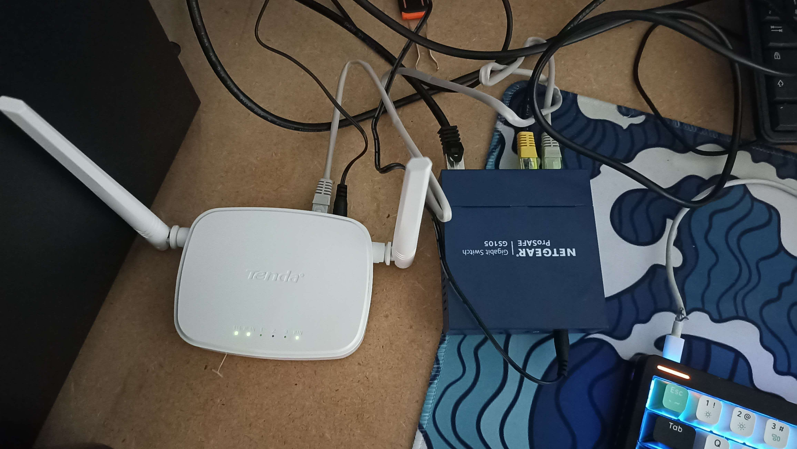
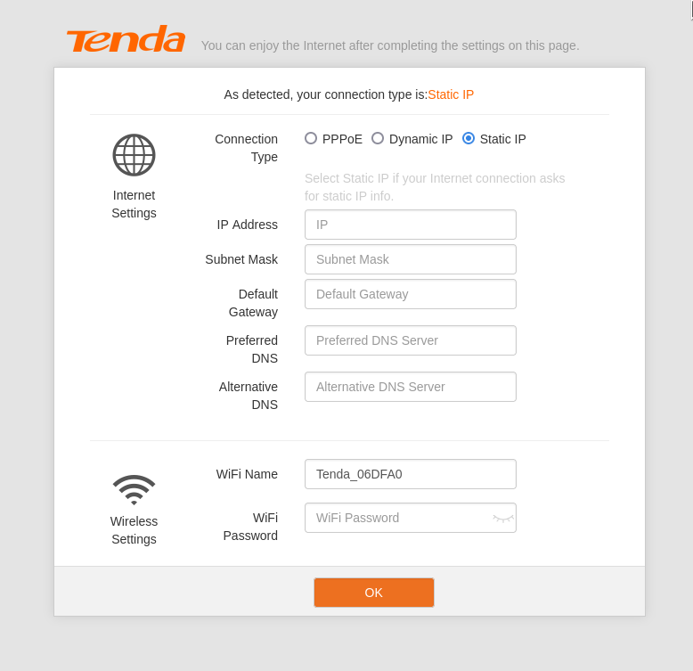
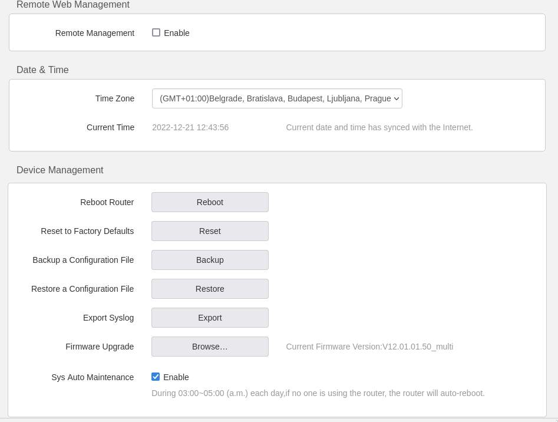
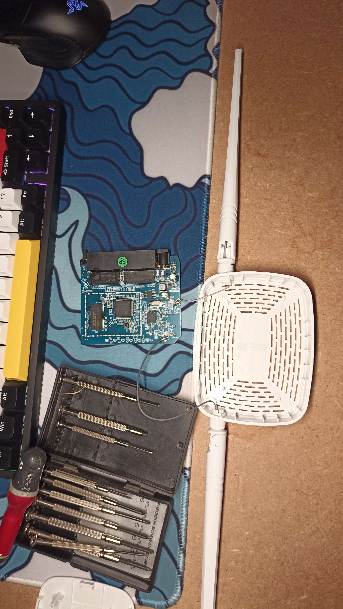
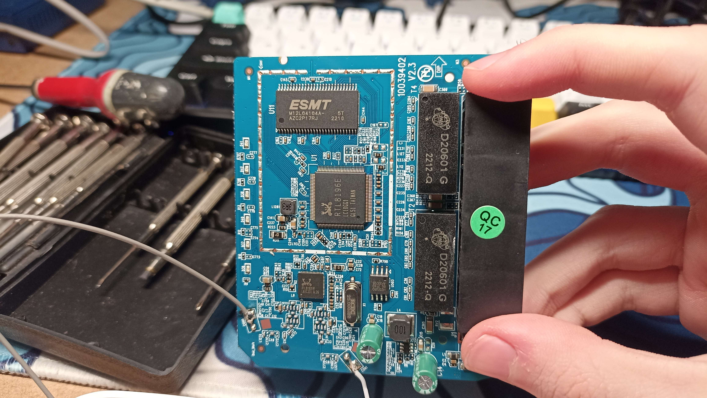
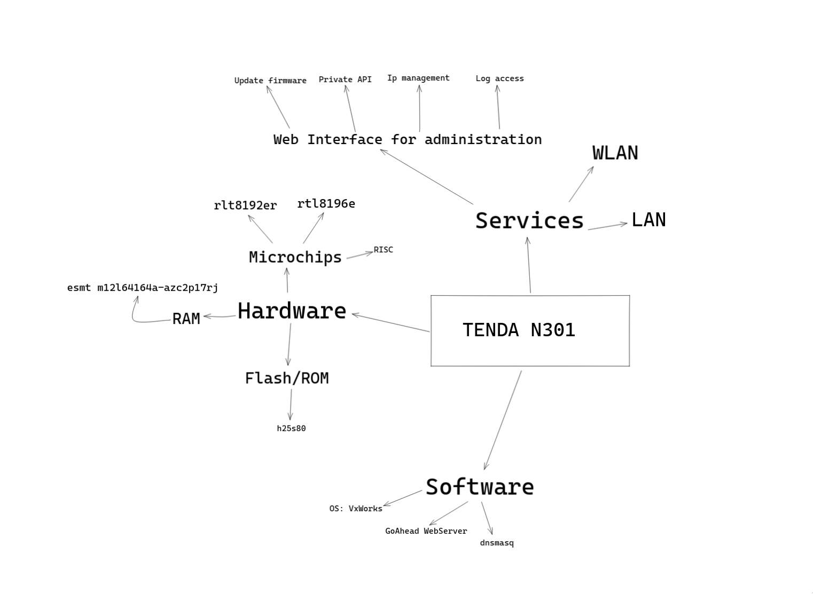

# TencaN301

## Introduction

After doing the **ph0wn** ctf at Nice in France. I became very interested in pwning hardware stuff. Like I've solved 0 challenges because I was stuck on the only pwn challenge which was pwning a little image viewer (a little device with a LCD screen). And that was the revelation: I've solved 0 challenges but I've learned a lot of thing and that was very excited. So let's reproduce this experience but with more time.

## What is TencaN301

TencaN301 is a router ( I think thie society which made the router is Indian), It is not quit expensive and I found the firmware online (so I don't have to extract from the sd-card, because I don't the skills).

## Recognition phase

First the recognition phase, I have to gather all the much informations I can about the router before diving into RE and hardware.
As I said before, I can retrieve the firmware so this is a good thing.

### Manufacturer website

On the manifacturer [site](https://www.tendacn.com/product/N301.html) we can see multiple specifications:

**Hardware**
```
Standard&Protocol   IEEE802.3, IEEE802.3u,IEEE802.3ab
Interfaces          1*10/100Mbps WAN port 3*10/100Mbps LAN ports
Antenna             2*5dBi external antennas
Button              1*RST
Power               Input：AC 100-240V~50/60Hz 0.6A Output：DC 9V0.6A
Dimension           127.4*90.5*26mm
LED Indicator       SYS、WLAN 1、 2、 3、 WAN
```

**Wireless**
```
Wireless Standard       IEEE 802.11b/g/n 2.4GHz
Data Rate               2.4GHz: Up to 300Mbps
Frequency               2.4GHz
Transmission Power      CE:<20dBm
Basic Features          WiFi On/Off
Wireless Security       WPA/WPA2, WPA-PSK/WPA2-PSK

```

**Software**
```
Internet Connection Type        PPPoE, Dynamic IP, Static IP    PPPoE(Russia), PPTP(Russia), L2TP(Russia)

Operating Mode                  Wireless Router Mode
                                Universal Repeater Mode
                                WISP Mode
                                AP Mode

DHCP Server                     DHCP Server
                                DHCP Client List
                                DHCP Reservation

Virtual Server                  Port Forwarding
                                DMZ Host
                                UPnP

Security                        Client Filter 
                                Parental Control(support black list and white list)
                                Remote Web Management

Firewall                        Forbid UDP flood attack
                                Forbid TCP flood attack
                                Forbid ICMP attack
                                Forbid WAN PING from internet

DDNS                            no-ip
                                DynDNS
                                Oray

VPN                             IPsec pass through
                                PPTP pass through
                                L2TP pass through

Special Features                Smart WiFi Schedule

Others                          Bandwidth Control
                                MAC Clone
                                System Log
                                Backup & Restore configurations
                                Firmware upgradeable via browser
```
There is interesting things, first we have norms ( in **Hardware** and **Wireless**) which can help us about how protocol are impleneted, we can update the firmware using the browser (so maybe we can spoof or create malicious firmware and inject it), we have an interface web (so a web server) to interact with clients. We have informations about the band rate, this can help us to identify componenet.

So we have 3 interfaces to interact with the router:
- hardware (inside the router)
- web interface
- physical (press buttons)

So now lets read the sheet brought with the router and try to find how to setup the router so we can learn how it work, we can setup a lab. After that lets deep dive into the fun part: insepcting the hardwares components.

So there is nothing usefull on the notices expected how to set up the router. So Lets setup it and familiarize with the env.

### Router administration

Here is my setup



After connecting my laptop to the router, This page openand on my web browser and I have no access to internet.



I configured a dynamic ip because I'm lazy... But it don't work, I can not connect to the internet. Hmmm very strange. Even if I try to with my phone I can not connect. boring.
Maybe try to connect to the outbound interface with my laptopt (like connect to the interface exposed to my network) or used nmap to obtain informations. But first lets find the ip address of the router (on my network) with nmap.
The nmap scan show nothing relevant, like I can not find the router. So lets reset it and configure it with static ip (maybe it will work).
Well, even with configuring it with a static ip. So lets search on internet a tutorial or documentation.

Okay so the problem was my netgear switch. The ethernet cable which link my tenda router to my router was not plugged... Well ... But now it work :D.

In the web interface I foudn interesting things


We can have access to logs, we can update our own firmware and we can enable remote management.
Now lets use nmap to scan ou router and try to have more informations.

```
ζ (master) ~/dev/research/TencaN301 sudo nmap -sS -sV -O -sU 192.168.0.1
Starting Nmap 7.80 ( https://nmap.org ) at 2022-12-21 12:52 CET
Nmap scan report for _gateway (192.168.0.1)
Host is up (0.0038s latency).
Not shown: 1996 closed ports
PORT     STATE         SERVICE VERSION
80/tcp   open          http    GoAhead WebServer
53/udp   open          domain  dnsmasq 2.75
123/udp  open|filtered ntp
1900/udp open|filtered upnp
MAC Address: D8:32:14:06:DF:A0 (Tenda Technology,Ltd.Dongguan branch)
Device type: general purpose
Running: Wind River VxWorks
OS CPE: cpe:/o:windriver:vxworks
OS details: VxWorks
Network Distance: 1 hop

OS and Service detection performed. Please report any incorrect results at https://nmap.org/submit/ .
Nmap done: 1 IP address (1 host up) scanned in 104.61 seconds
```

Okay so the router run on VxWorks os (which I dont know) and it have a WebServer, DNSserver.

### Hardware

Now the fun part, lets open the router... It was very simple to open the router, just some plastic clips.



We can identify theses components:
- rtl8196e (surely microchip)
- rlt8192er (another microchip)
- esmt m12l64164a-azc2p17rj
- d29601g ( x 2)
- h25s80
Let's google that

#### rtl8196e

So the rtl8196e is a microchip from [realtek](https://www.realtek.com/en/products/communications-network-ics/item/rtl8196e), designed for ethernet router. Here are the specifications given on the realtek site:
```

General Description
The Realtek RTL8196E family integrates a high performance 400MHz RISC CPU, five-port Fast Ethernet switch with PHY, SDR and DDR memory controller, flash memory controller, USB2.0 controller, and useful peripheral interfaces. The RTL8196E delivers high performance with low power consumption for 802.11n AP router application.
Features

    CPU
    RISC 400MHz
    I-Cache 16KB / D-Cache 8KB
    I-MEM 16KB / D-MEM 8KB

    Memory
    16-bit SDR, DDR1 and DDR2
    SPI NOR Flash

    Interfaces
    Five 10/100M Ethernet Port
    One PCIe Gen1 Host
    One USB2.0
    Two UART
    Up to 16 GPIO
```

#### rlt8192er

It chip is also from realtek (that was obvious by their name),  this is a chip which integrate wlan and network pcie controller. So the **rtl8196e** handle the lan and the  **rlt8192er** handle the wlan.
[Link](https://www.realtek.com/en/products/communications-network-ics/item/rtl8192er)

```

General Description
The Realtek RTL8192ER-CG is an 802.11bgn 2.4G single-chip that integrates Wireless LAN (WLAN) and a network PCIe controller. It combines a WLAN MAC, a 2T2R capable WLAN baseband, and WLAN RF in a single chip. The RTL8192ER-CG provides a complete solution for a high-throughput performance and low power consumption integrated wireless LAN device.
Features

    56-pin QFN
    802.11bgn
    Integrated PA/LNA/TRSW
    MIMO Power Saving Mechanism
    Channel Management and Co-existence

Applications

    This product is applicable for TV, Set-Top box/Over-The-Top box, IP Camera, etc. Wi-Fi applications

```

#### esmt m12l64164a-azc2p17rj

From this usefull [site](https://www.alldatasheet.com/datasheet-pdf/pdf/128313/ESMT/M12L64164A.html), we found this is the ram (and we have the datasheet :D).

#### d29601g

I can't find references.

#### h25s80

I sound like this is the flash but I can not find datasheet when googling the name. But I found somthing else on this reddit [post](https://www.reddit.com/r/hardwarehacking/comments/z78ad1/trying_to_extract_firmware_from_a_tenda_n301/). Another people try to pwn Tenda N301 router nice :D
And on the response we have a github to somebody who have already reverse the firmware. So this is a good news because if I'm stuck on a something, I have a "soluce". The guys on the blogpost don't find a datasheet for the **h25s80** but it confirm me that this is the flash/rom.

After more research I found another [project](https://github.com/w3slee/Tenda-Firmware-Reversing) on github of somebody who have already reverse it with ghidra.

So lets do a recap.

